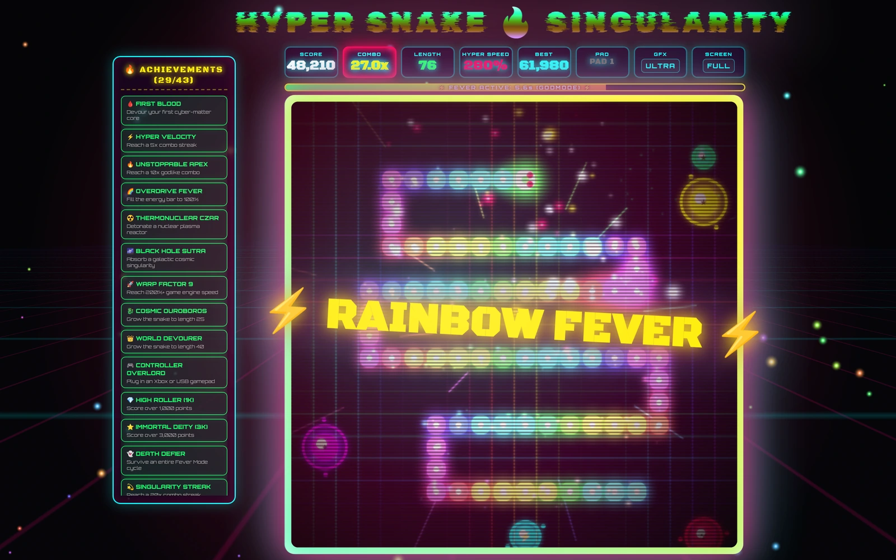
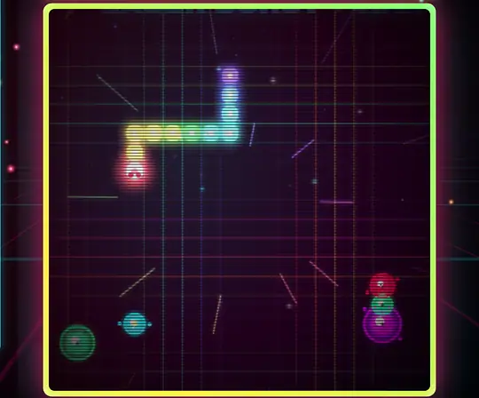
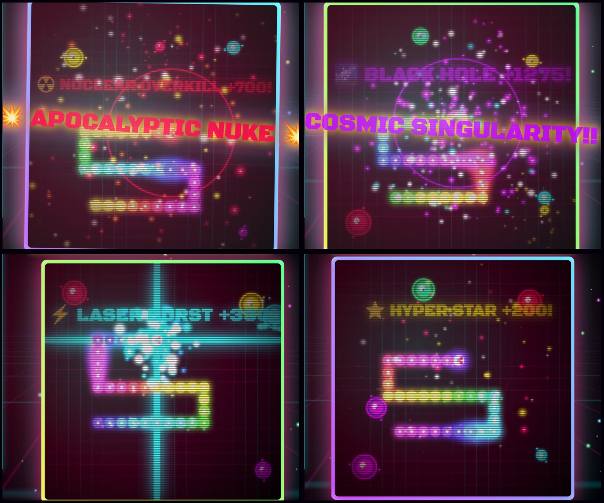
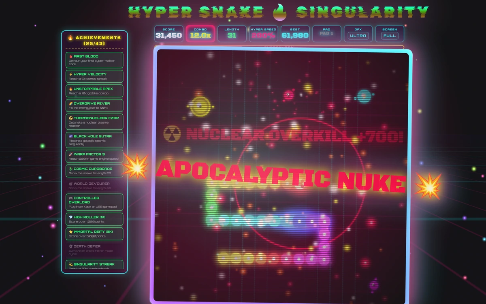
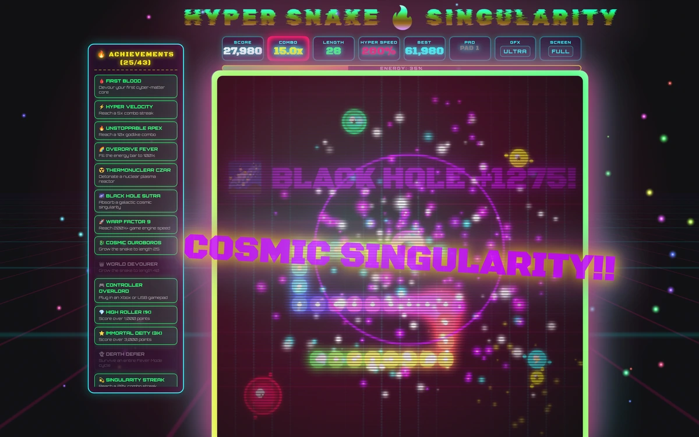
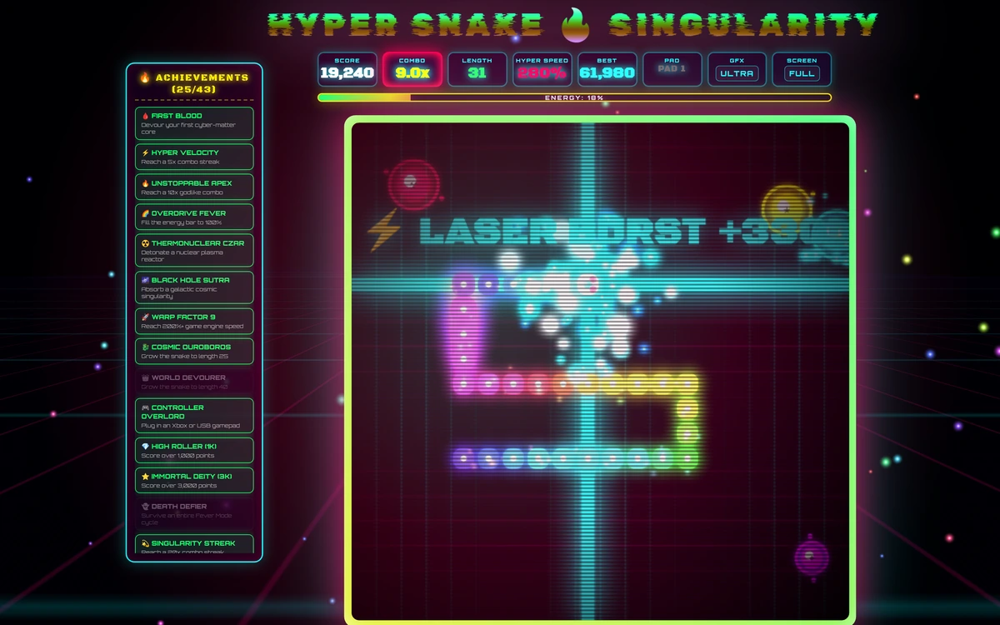
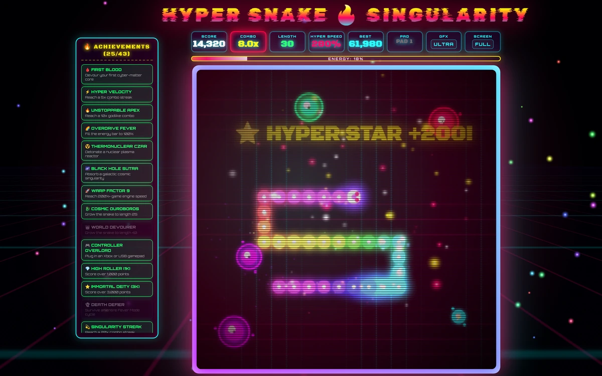
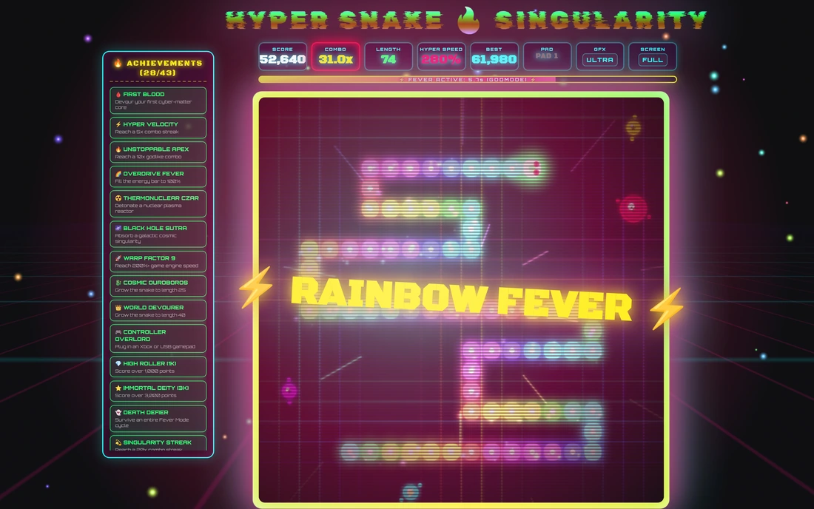
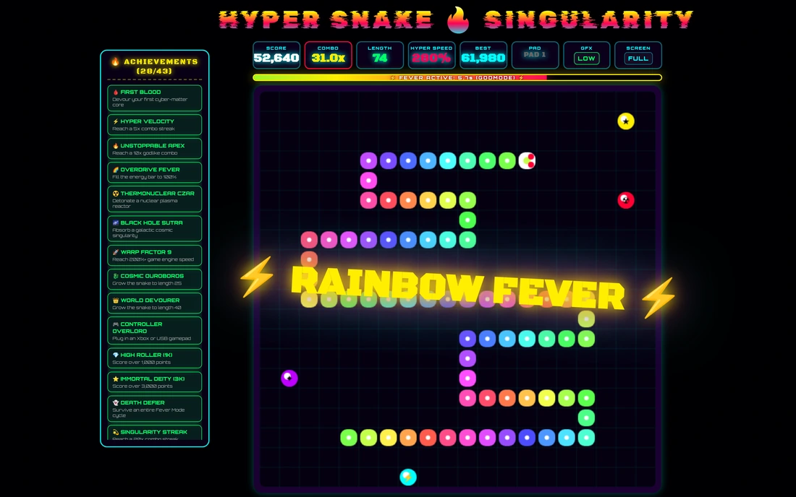

<div align="center">

# 🔥💥 HYPER-SNAKE OMEGA 💥🔥
## ⚡ APOCALYPSE SINGULARITY ⚡

**MAXIMUM UNCHAINED OVERKILL • 150BPM SYNTHWAVE • ZERO INHIBITIONS • FULL GAS**

[](index.html)
[](#-how-to-run-locally)
[](#-how-to-run-locally)
[](#-43-persistent-achievements)
[](#-hardcore-procedural-audio-engine-web-audio-api)

# [▶ PLAY IT RIGHT NOW](https://janost.github.io/hyper-snake-omega/)



<sub><b>RAINBOW FEVER.</b> 76 segments, 27x combo, 280% engine speed, walls turned off.</sub>

</div>

---

## 💀 WHAT IS THIS MONSTROSITY?!

Forget whatever boring, beige, 1997 Nokia snake game you played in middle school. **HYPER-SNAKE: APOCALYPSE SINGULARITY** is a dopamine-fueled, retrowave-blasted, screen-shaking, thermonuclear arcade acid trip that turns a simple grid game into **PURE UNFILTERED CYBERPUNK CHAOS**.

Built into a **single, self-contained `index.html` file** with **zero external JS libraries** and **zero image assets**. Everything—the audio synthesizer, drum sequencer, particle physics, 3D warp grid, and bloom shaders—is generated raw on the metal in real time.

```
   _____ _   _          _  ________    ____  __  __ ______ _____          
  / ____| \ | |   /\   | |/ /  ____|  / __ \|  \/  |  ____/ ____|   /\    
 | (___ |  \| |  /  \  | ' /| |__    | |  | | \  / | |__ | |  __   /  \   
  \___ \| . ` | / /\ \ |  < |  __|   | |  | | |\/| |  __|| | |_ | / /\ \  
  ____) | |\  |/ ____ \| . \| |____  | |__| | |  | | |___| |__| |/ ____ \ 
 |_____/|_| \_/_/    \_\_|\_\______|  \____/|_|  |_|______\_____/_/    \_\
```

<div align="center">



<sub>Five seconds of it. Laser cross-beams, a nuclear whiteout, and Fever kicking in.</sub>

</div>

---

## ⚡ ULTRA WEAPONRY & POWER-UP ARSENAL

<div align="center">



<sub>Nuke · Singularity · Cross-beam · Hyper Star</sub>

</div>

| ICON | ITEM | DISASTER LEVEL | WHAT HAPPENS |
|---|---|---|---|
| 🟢 | **Core Matter** | STANDARD | Basic fuel. Builds the combo streak. |
| ⭐ | **Hyper Star** | ULTRA | High-multiplier score booster. Spawns explosive shock rings. |
| ⚡ | **Laser Cross-Beam** | LETHAL | Dual laser beams flash across the full row and column you ate on. |
| ☢️ | **Thermonuclear Nuke** | APOCALYPTIC | Screen-wide whiteout flash, 4-corner high-voltage lightning strikes, extreme screen violence. |
| 🌌 | **Black Hole Singularity** | COSMIC EXTINCTION | Biggest score payout on the board. Arcs a violet gravity tether to every other food still on the grid. |

<details>
<summary><b>🔬 Open the full-size shots</b></summary>

<br>

**☢️ THERMONUCLEAR NUKE** — whiteout flash, lightning arced to all four corners, 160 particles off one tile.



**🌌 BLACK HOLE SINGULARITY** — the well pulls every particle on the board in on inverse-square attraction until it collapses.



**⚡ LASER CROSS-BEAM** — full-canvas beams down the row and column you ate on.



**⭐ HYPER STAR** — multiplier payout and a shock ring.



</details>

---

## 🌈 RAINBOW FEVER GODMODE

Fill your Overdrive gauge to 100% to trigger **RAINBOW FEVER**:
- 🚀 **Invulnerability** against wall crashes (warp through the grid edge).
- 👻 **Immunity** against eating your own tail.
- ⚡ **2.0x Baseline Combo Multiplier** stacked on top of existing streaks.
- 🌈 **Full-Spectrum Chromatic Rainbow Dragon Trail**.

---

## 🏆 43 PERSISTENT ACHIEVEMENTS

Tracked live in the cyber-sidebar and saved across sessions via `localStorage`. The unlocks themselves are permanent. The ones marked **per run** have to be earned inside a single life and their counters reset the moment you respawn; the ones marked **lifetime** tally across every run you have ever played.

- 🩸 **FIRST BLOOD** — Devour your first cyber-matter core.
- ⚡ **HYPER VELOCITY** — Reach a 5x combo streak.
- 🔥 **UNSTOPPABLE APEX** — Reach a 10x godlike combo streak.
- 🌈 **OVERDRIVE FEVER** — Fill the energy gauge to 100%.
- ☢️ **THERMONUCLEAR CZAR** — Detonate a nuclear plasma reactor.
- 🌌 **BLACK HOLE SUTRA** — Absorb a galactic cosmic singularity.
- 🚀 **WARP FACTOR 9** — Reach 200%+ engine speed.
- 🐉 **COSMIC OUROBOROS** — Grow to length 25.
- 👑 **WORLD DEVOURER** — Grow to length 40.
- 🎮 **CONTROLLER OVERLORD** — Plug in an Xbox or USB gamepad.
- 💎 **HIGH ROLLER (1K)** — Score over 1,000 points.
- ⭐ **IMMORTAL DEITY (3K)** — Score over 3,000 points.
- 👻 **DEATH DEFIER** — Ride out an entire Fever Mode cycle without dying.
- 💫 **SINGULARITY STREAK** — Reach a 20x combo streak.
- 🌟 **GALACTIC TYCOON (10K)** — Score over 10,000 points.
- 🐍 **ENDLESS LEVIATHAN** — Grow to length 60.
- 🏎️ **TERMINAL VELOCITY** — Pin the engine at its top speed.
- ☢️ **FALLOUT ENTHUSIAST** — Detonate 3 nukes, **per run**.
- 🕳️ **EVENT HORIZON** — Absorb 3 singularities, **per run**.
- 🔫 **BEAM ARCHITECT** — Fire 5 laser cross-beams, **per run**.
- 🍽️ **BALANCED DIET** — Eat all five matter types, **per run**.
- 🔁 **PERPETUAL OVERDRIVE** — Trigger Fever 3 times, **per run**.
- 🌀 **PHASE SHIFTER** — Warp through the grid edge during Fever.
- 🧊 **COLD BLOODED** — Score 1,000 before ever triggering Fever, **per run**.
- ⏳ **LONG HAUL** — Survive a single run for 2 minutes.
- 🌠 **COMET CHAIN** — Reach a 30x combo streak.
- 🏦 **COSMIC OLIGARCH (25K)** — Score over 25,000 points.
- 🪐 **HEAT DEATH SURVIVOR (50K)** — Score over 50,000 points.
- 🪢 **PLANET GIRDLE** — Grow to length 100.
- 💣 **MUTUALLY ASSURED** — Detonate 10 nukes, **per run**.
- 🧲 **GRAVITY ADDICT** — Absorb 5 singularities, **per run**.
- 🎯 **BEAM SATURATION** — Fire 15 laser cross-beams, **per run**.
- 🥵 **FEVER DREAM** — Trigger Fever 5 times, **per run**.
- 🌪️ **DIMENSIONAL DRIFTER** — Warp the grid edge 10 times, **per run**.
- 🗺️ **CARTOGRAPHER** — Feed from all four corners, **per run**.
- 🏹 **STRAIGHT SHOOTER** — Travel 20 tiles without turning.
- ♨️ **HOT START** — Reach a 5x combo in the first 15 seconds, **per run**.
- 🚄 **FAST MONEY** — Score 1,000 inside 30 seconds, **per run**.
- 🕰️ **MARATHONER** — Survive a single run for 5 minutes.
- 🍔 **GLUTTON PRIME** — Devour 1,000 cores, **lifetime**.
- 🎰 **HABITUAL** — Start 50 runs, **lifetime**.
- 💀 **SISYPHUS** — Die 100 times, **lifetime**.
- 🏆 **SINGULARITY COMPLETE** — Unlock every other trophy.

---

## 🔊 HARDCORE PROCEDURAL AUDIO ENGINE (Web Audio API)

No MP3s. No WAV files. No network lag.
- **150 BPM Darksynth Drum Machine**: Real-time synthesized kicks, snappiest noise claps, and open hi-hats.
- **Rolling Acid Bassline**: Dynamic low-pass resonant filter sweeps that crank up and distort as your combo grows.
- **Sound FX Synthesizers**: Procedural white-noise explosion filters, FM laser sweeps, ascending singularity risers, and victory fanfare chords.

---

## 🎮 CONTROLS & HARDWARE SUPPORT

- ⌨️ **Keyboard**: Arrow Keys or WASD to steer, Space / Enter to restart, **F** for fullscreen.
- 🎮 **Xbox / Bluetooth Gamepad API**:
  - **D-Pad / Left Thumbstick**: Full 4-way navigation with analog deadzone filtering.
  - **A / X / Start button**: Start game / Instant Respawn.
  - **Dual-Rumble Haptic Feedback**: Dynamic low/high-frequency motor vibration triggers on eating, nuke detonations, laser bursts, black holes, and deaths.
- 📱 **Touch D-Pad**: Automatic on-screen touch overlay on phones & tablets.

---

## 🖥️ IT SCALES

The board grows to fill whatever room it has. The column takes the viewport height, the chrome takes what it needs, and the board absorbs everything left over, so there is no magic reserve to get wrong when the title reflows or the touch d-pad appears.

Hit **FULL** in the HUD (or press **F**) and it reclaims the browser chrome too. Same 20x20 grid at every size — only the pixels get bigger, never the board.

| viewport | board |
|---|---|
| 900 x 613 | 449px |
| 1280 x 713 | 530px |
| 1920 x 1093 | 884px |
| 2400 x 1413 | 1100px (capped) |

The canvas keeps a fixed 540x540 backing store and CSS stretches it, so every draw call still works in the coordinate space it was written for. `--board-max` is the ceiling on how far it stretches: 1100px windowed, 1500px fullscreen.

---

## 🔮 THE FX PIPELINE

Everything on the game canvas is drawn per frame from primitives. No sprites on disk, no shader files.

- **Bloom** — the scene is downsampled through a chain of halved buffers and composited back additively. The downsample *is* the blur.
- **Glow sprites** — one radial-gradient sprite is baked per colour and blitted additively. Particles, the snake halo, food halos and the ambient starfield all come from the same cache.
- **Gravity wells** — a black hole pickup leaves a singularity that pulls every particle on inverse-square attraction until it collapses.
- **The swallow** — eating sends a wave from the head to the tail, swelling each segment as it passes.
- **Chromatic aberration** — opposed red/cyan drop-shadows on the whole rig, spiked by nukes, singularities, Fever and death.
- **Warp streaks** — radial speed lines during Fever.
- **Screen shake, zoom, roll, strobe and CRT scanlines** — camera and overlay work, all frame-rate independent.

**LOW GFX turns off every one of these.** The game plays identically; it just stops painting.

---

## ⚠️ PHOTOSENSITIVITY & THE GFX TOGGLE

This game strobes hard by default. The **GFX** button in the HUD switches between **ULTRA** and **LOW**; LOW drops the bloom, the screen shake, the full-screen flashes, the chromatic aberration, the warp grid, the ambient particle field and every looping strobe animation, and the choice is remembered in `localStorage`.

If your OS is set to **reduce motion**, the game starts in LOW automatically and the flashing elements stay disabled even if you switch back to ULTRA.

| 🔥 ULTRA | 🧊 LOW |
|---|---|
|  |  |

Same snake, same board, same 31x combo. Only the painting changes.

---

## 🚀 HOW TO RUN LOCALLY

No `npm install`. No `docker run`. No build steps.

```bash
# Clone the madness
git clone https://github.com/janost/hyper-snake-omega.git

# Open directly in any modern browser
cd hyper-snake-omega
xdg-open index.html # Or open index.html in Chrome/Firefox/Safari
```

---

<div align="center">

# [▶ PLAY IT RIGHT NOW](https://janost.github.io/hyper-snake-omega/)

**🔥 NOW GO FORTH AND DEVOUR THE COSMOS 🔥**

</div>
